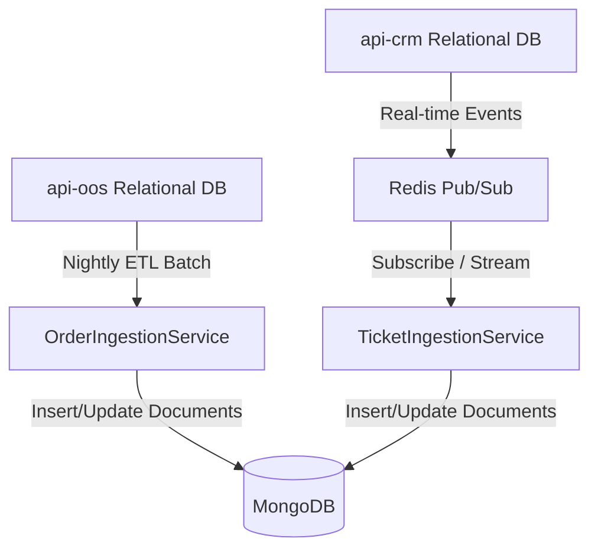

# AI-Analytics Ingestion Strategy

This document describes the data ingestion strategy for the AI-Analytics service in the SentraCX system.

## Ingestion Architecture

The AI-Analytics service employs a hybrid data ingestion model tailored to the lifetime, size, and real-time latency needs of the analytics features it supports.

---

## 1. Batch Syncing (api-oos Order Data)
For large-scale historical transaction data (orders, cancellations, line items), real-time updates are unnecessary for features like Customer Lifetime Value (CLV) and churn segmentation.
- **Mechanism**: Nightly sync via an async HTTP client (`oos_client.py`) querying delta updates from `api-oos`.
- **Scheduler**: Managed by `APScheduler` within the FastAPI lifespan.
- **ETL Transform**: Transforms transactional, tabular order rows into denormalized document representations stored in MongoDB's `CustomerFeatureLogs` (or equivalent collections) to serve ML inputs.

---

## 2. Event-Driven Syncing (api-crm Ticket & Conversation Data)
Real-time insights (e.g., ticket sentiment, chat escalation flags, smart replies) require a sub-2s latency SLA.
- **Mechanism**: Redis Pub/Sub channels (reusing the existing CRM-Redis event transport) are utilized.
- **Event Flow**:
  - `api-crm` publishes events to Redis channels (e.g., `ticket:created`, `message:sent`).
  - `api-ai-analytics` subscribes to these channels at lifespan startup via a background task listener.
  - The inbound payload is validated with Pydantic and ingested into MongoDB's `ConversationTranscripts` or `tickets` store.
  - Relevant ML/sentiment predictions are performed immediately, and the output is cached back in Redis (`ticket:{id}:sentiment_stream`) and written to MongoDB.

---

## 3. Data Freshness and TTLs
All stored calculations include a `computed_at` field.
- **Staleness Policies**:
  - Churn Score / CLV: 24-hour max staleness.
  - Ticket Analysis / Sentiment: Sub-5 seconds.
- **Cache Invalidation**: Fresh computation busts the Redis cache; keys expire automatically via TTL (e.g., 24h for churn, 12h for next-best-action, 1h for ticket analyses).
