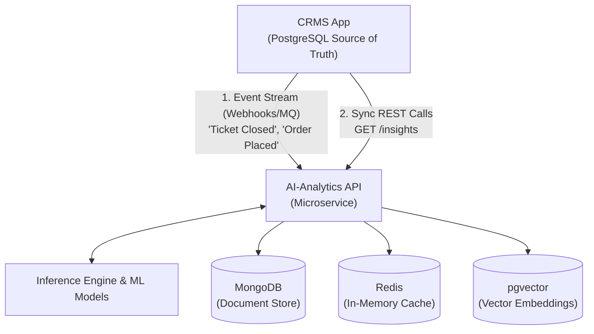
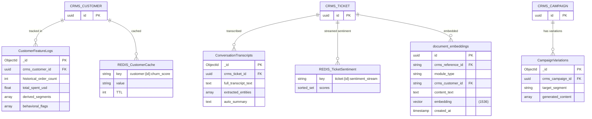

# AI-Analytics Microservice: Polyglot Persistence Data Model

This document outlines the polyglot persistence architecture for the SentraCX AI-Analytics microservice. Because this service acts as a specialized analytical engine distinct from the primary Customer Relationship Management System (CRMS), it employs three separate data storage technologies. Each database is deliberately chosen based on the specific read/write access patterns and data shapes of the AI features it supports.

---

## 1. Architecture Diagram

The CRMS retains ownership of the source-of-truth transactional data (PostgreSQL). Data flows into the AI-Analytics service primarily via event-driven mechanisms (webhooks/message queues) for offline processing, while the CRMS retrieves insights via synchronous REST API calls.



---

## 2. MongoDB — Semi-Structured & Flexible Data

### Why it fits this workload
Machine Learning feature stores, AI-generated content variations, and NLP transcripts often possess highly volatile, deeply nested schemas. As data scientists or engineers iterate on ML models, the required input features (e.g., adding a new `behavioral_flag` array) change frequently. MongoDB's schema-on-read flexibility accommodates these changes without requiring rigid SQL migrations. Furthermore, it easily absorbs high-volume, append-heavy workloads like tracking denormalized customer behavior snapshots.

### Data Flow
**Event-Driven (Push)**. When records are created or updated in the CRMS (e.g., a ticket is closed, a campaign ends), the CRMS publishes an event. The AI service consumes this event and stores a denormalized snapshot in MongoDB for batch model training and trend analytics.

### Schema Examples
*All IDs prefixed with `crms_` are Foreign Keys referencing the CRMS PostgreSQL database.*

**Collection: `CustomerFeatureLogs` (Used for Churn & CLV model training)**
```json
{
  "_id": "ObjectId(...)",
  "crms_customer_id": "uuid-1234",
  "historical_order_count": 15,
  "total_spent_usd": 1250.50,
  "last_interaction_date": "2026-07-15T10:00:00Z",
  "derived_segments": ["High-Value", "At-Risk"],
  "behavioral_flags": ["cart_abandonment_spike", "negative_ticket_sentiment"],
  "recorded_at": "2026-07-16T00:00:00Z"
}
```

**Collection: `CampaignVariations` (Used for AI-Generated Content Suggestions)**
```json
{
  "_id": "ObjectId(...)",
  "crms_campaign_id": "uuid-5678",
  "target_segment": "Dormant",
  "generated_content": [
    {
      "subject_line": "We miss you! Here is 20% off.",
      "predicted_open_rate": 0.45,
      "tone": "friendly"
    }
  ]
}
```

**Collection: `ConversationTranscripts` (Used for Auto-Summarization & Entity Extraction)**
```json
{
  "_id": "ObjectId(...)",
  "crms_ticket_id": "uuid-9012",
  "full_transcript_text": "Customer: Where is my order? Agent: It shipped today.",
  "extracted_entities": [
    { "entity_type": "product_name", "value": "Wireless Earbuds" }
  ],
  "auto_summary": "Customer inquired about order status, agent confirmed shipment."
}
```

*Note: Transcript analysis, categorization, and sentiment extraction are powered by the Groq API (llama-3.1-8b-instant) with heuristic fallback when the API is unavailable.*

---

## 3. Redis — Low-Latency & Ephemeral Data

### Why it fits this workload
Certain AI predictions (like Churn Score, CLV, or Next-Best-Action) are constantly calculated in the background but must be retrieved instantly (sub-millisecond latency) when a CRMS user opens a customer profile. Other data, like real-time sentiment tracking during a live chat, requires rapid, atomic updates. Redis's in-memory architecture is perfect for this. Additionally, Redis supports native TTL (Time-To-Live), ensuring that stale predictions expire automatically if the batch job fails to update them.

### Data Flow
**Batch Sync & Streamed**. Background ML jobs calculate scores nightly and `SET` them in Redis. For live conversations, sentiment models evaluate streaming messages and push scores to a Redis Sorted Set.

### Key Patterns & Structures
*   **Churn & CLV Scores** (String with TTL)
    *   **Key**: `customer:{crms_customer_id}:churn_score`
    *   **Value**: `"0.85"`
    *   **TTL**: 24 hours (forces recalculation).
*   **Next-Best-Action Recommendation** (Hash with TTL)
    *   **Key**: `customer:{crms_customer_id}:next_action`
    *   **Value**: `{ "action": "offer_discount", "confidence": "0.92" }`
    *   **TTL**: 12 hours.
*   **Real-Time Sentiment Tracking** (Sorted Set)
    *   **Key**: `ticket:{crms_ticket_id}:sentiment_stream`
    *   **Score**: Unix Timestamp (allows querying the sentiment trend over time)
    *   **Value**: `"-0.75"` (Negative), `"0.90"` (Positive)
    *   *Usage*: Allows the Unified Dashboard to instantly detect if a live conversation is escalating negatively.
*   **Ticket Analysis Cache** (String with TTL)
    *   **Key**: `ticket:{crms_ticket_id}:analysis`
    *   **Value**: `{ "sentiment": "negative", "category": "shipping", "urgency_score": 0.8, ... }`
    *   **TTL**: 1 hour.

---

## 4. Vector Store — pgvector (PostgreSQL Extension)

### Recommendation: `pgvector`
For a capstone/thesis project, deploying `pgvector` on a *separate, dedicated* PostgreSQL instance for the AI service is the optimal choice. While standalone vector databases (like Qdrant or Pinecone) are powerful, `pgvector` leverages a familiar, battle-tested ecosystem. It demonstrates a sophisticated understanding of vector math (Cosine Similarity, L2 Distance) without adding the operational bloat of learning a completely new database vendor. 

### Why it fits this workload
Standard relational databases index data for *exact* keyword matches (B-Trees). However, features like Natural Language Query ("Show me customers angry about shipping"), Intent Detection, and Smart Reply Suggestions require *Semantic Search*. By converting text into high-dimensional float arrays (embeddings) via an LLM, the vector database can mathematically find "nearest neighbors" — text that means the same thing, even if different words are used.

### Data Flow
**Event-Driven (Pipeline)**. When a ticket is closed in the CRMS, the AI service receives the text, calls an embedding API (e.g., OpenAI `text-embedding-3-small`), and inserts the resulting vector into `pgvector`.

### Schema Example
**Table: `document_embeddings`**
| Column | Type | Description |
| :--- | :--- | :--- |
| `id` | UUID (PK) | Unique identifier for the embedding |
| `crms_reference_id` | String | FK to the source (e.g., `ticket_id`, `message_id`) |
| `module_type` | String | E.g., 'Ticket', 'Conversation_Message' |
| `crms_customer_id` | String | FK used for filtering (e.g., "Search only within this user's history") |
| `content_text` | Text | The actual raw text that was embedded |
| `embedding` | Vector(1536) | The mathematical representation of the text |
| `created_at` | Timestamp | For time-decay filtering in semantic search |

**Example Query Pattern (Intent Detection):**
When a new customer message arrives, the system embeds it and queries `pgvector` for the closest historical messages. If the 5 closest matches were previously categorized as "Refund Request", the system auto-categorizes the new message as a "Refund Request."

---

## 5. API Exposure (CRMS Integration)

Because the AI-Analytics service is separate, the CRMS consumes its outputs via lightweight REST API endpoints. The CRMS acts as a presentation layer, querying the AI service when rendering specific pages.

*   `GET /api/v1/customers/{crms_customer_id}/insights`
    *   *Reads from:* Redis (Sub-millisecond).
    *   *Returns:* `{ "churn_score": 0.85, "clv_prediction": 1200.0, "next_best_action": "offer_discount" }`
*   `POST /api/v1/tickets/analyze-intent`
    *   *Payload:* `{ "text": "The item I received is broken!" }`
    *   *Action:* Embeds text in real-time, queries `pgvector` for nearest neighbors.
    *   *Returns:* `{ "predicted_category": "technical_issue", "urgency_score": 0.9 }`
*   `GET /api/v1/analytics/dashboard/unified`
    *   *Reads from:* MongoDB (Aggregation pipelines for trends).
    *   *Returns:* Aggregated metrics across Campaign ROI, average sentiment, and ticket volume forecasts.

---

## 6. Polyglot Schema ER Diagram

The diagram below visually represents how the CRMS's PostgreSQL tables relate to the varied data structures inside the AI-Analytics service (MongoDB collections, Redis keys, and pgvector tables).


