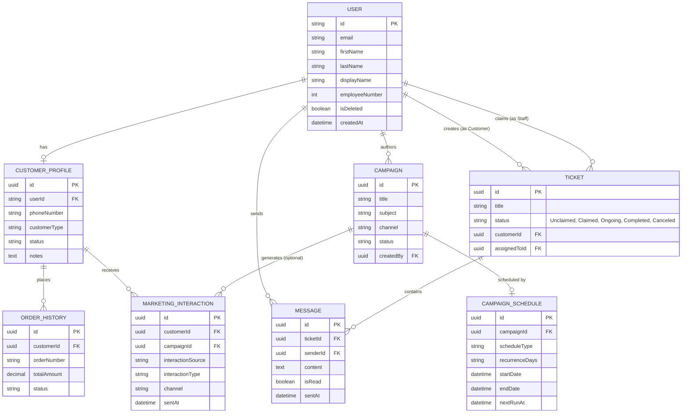
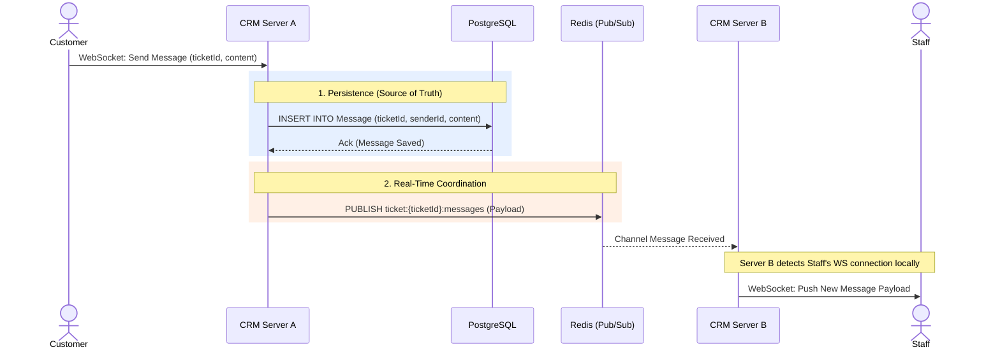

# CRM Data Model & Real-Time Architecture

This document outlines the schema, relationships, and real-time WebSocket architecture for the SentraCX CRM system. The CRM functions as a separate application from the AI-Analytics service, utilizing PostgreSQL as the primary persistence layer and Redis exclusively for real-time WebSocket coordination.

## 1. Entity Definitions (PostgreSQL)

### 1. User (Mirrored from Central Auth)
Represents all system actors, including internal staff (managers, employees) and external customers. Authentication and core identity are managed centrally by the Internal Auth Service.
- `id` (PK): String (Maps to IdentityUser.Id / UUID in Auth Service)
- `email`: String (Unique)
- `firstName`: String (Synced from Auth)
- `lastName`: String (Synced from Auth)
- `displayName`: String (Synced from Auth)
- `employeeNumber`: Integer (Nullable, Synced from Auth for Staff)
- `isDeleted`: Boolean (Soft delete status, Synced from Auth)
- `createdAt`: DateTime
- `updatedAt`: DateTime

*(Design Note: Roles/Permissions are derived from JWT claims upon login, ensuring the Central Auth remains the authoritative source for access control rather than duplicating a local enum.)*

### 2. CustomerProfile
Extended CRM-specific details for external customers. Core identity details (name, email) are kept on the `User` record.
- `id` (PK): UUID
- `userId` (FK): String (One-to-One with User)
- `phoneNumber`: String (Nullable)
- `customerType`: Enum (Regular, InstitutionalBuyer)
- `status`: Enum (Active, Inactive, Suspended)
- `notes`: Text (Nullable)
- `profileImage`: String (URL, Nullable)
- `createdAt`: DateTime
- `updatedAt`: DateTime

### 3. Campaign
Manages marketing and outreach campaigns.
- `id` (PK): UUID
- `title`: String
- `subject`: String
- `description`: Text
- `channel`: Enum (Email, InApp)
- `status`: Enum (Draft, Active, Ended)
- `templateId`: String (Nullable)
- `imageUrl`: String (Nullable)
- `createdBy` (FK): UUID (Staff)
- `createdAt`: DateTime

### 4. CampaignSchedule
Manages the recurrence rules for campaigns.
- `id` (PK): UUID
- `campaignId` (FK): UUID (One-to-One with Campaign)
- `scheduleType`: Enum (SendNow, Scheduled, Recurring)
- `recurrenceDays`: Array<Enum(Monday...Sunday)> (Nullable, used if Recurring)
- `startDate`: DateTime (Nullable)
- `endDate`: DateTime (Nullable)
- `nextRunAt`: DateTime (Nullable)

*(Design Note: A separate table is chosen over a simple array field on `Campaign` to accommodate future complexity, such as cron expressions, timezones, specific end dates, or exception dates. This keeps the main `Campaign` table lean while supporting scheduling complexity gracefully, which is highly defensible for enterprise-grade applications.)*

### 5. MarketingInteraction
Tracks the history of interactions between a customer and the business.
- `id` (PK): UUID
- `customerId` (FK): UUID
- `interactionSource`: Enum (Campaign, ManualOutreach)
- `campaignId` (FK): UUID (Nullable)
- `title`: String
- `description`: Text
- `channel`: Enum (Email, InApp, Call, Meeting)
- `interactionType`: String (e.g., Sent, Opened, Clicked, Logged)
- `sentAt`: DateTime

*(Design Note: `campaignId` is nullable and `interactionSource` was introduced so staff can log ad-hoc manual outreach without forcing the creation of dummy campaigns. This correctly reflects the reality of unstructured sales touchpoints.)*

### 6. Ticket
Customer support inquiries and requests.
- `id` (PK): UUID
- `title`: String
- `description`: Text
- `imageUrl`: String (Nullable)
- `status`: Enum (Unclaimed, Claimed, Ongoing, Completed, Canceled)
- `customerId` (FK): UUID (Created By)
- `assignedToId` (FK): UUID (Claimed By Staff, Nullable)
- `createdAt`: DateTime
- `updatedAt`: DateTime

*(Design Note on Ticket Status Mapping: The DB maintains a single source of truth for the state machine (`Unclaimed`, `Claimed`, `Ongoing`, `Completed`, `Canceled`). The UI dynamically computes customer-facing tabs from this DB status. For Customers, `Unclaimed` and `Claimed` both map to the "Pending" UI tab. This eliminates duplicate DB columns and prevents state desynchronization.)*

### 7. Message (Conversation)
Real-time chat messages linked to specific tickets.
- `id` (PK): UUID
- `ticketId` (FK): UUID
- `senderId` (FK): UUID
- `content`: Text
- `isRead`: Boolean (Default: False)
- `sentAt`: DateTime

*(Design Note: `receiverId` is intentionally omitted. Storing a receiver explicitly risks data staleness if a ticket is reassigned to a different staff member halfway through a conversation. The recipient is dynamically derived at query time via a join on the parent `Ticket`'s `customerId` and `assignedToId`.)*

### 8. OrderHistory (External/Synced)
Read-only view of e-commerce orders linked to a customer.
- `id` (PK): UUID
- `customerId` (FK): UUID
- `orderNumber`: String
- `totalAmount`: Decimal
- `status`: String
- `orderedAt`: DateTime

*(Design Note on Sync Mechanism: OrderHistory is populated via an **Event-Driven Webhook** architecture. When the ecommerce system registers an order, it pushes an event to a message broker. The CRM consumes this to write to `OrderHistory`. This guarantees real-time consistency, as the AI-Analytics service can consume the exact same event stream without polling overhead.)*

---

## 2. Redis Integration for WebSocket Chat

The CRM uses Redis strictly for **real-time transport and coordination**, not persistence. PostgreSQL remains the absolute source of truth. Every chat message is committed to PostgreSQL and simultaneously published to Redis to achieve real-time fan-out across server nodes. 

*(Note: This usage is conceptually distinct from the AI-Analytics microservice, which uses Redis for ML inference caching. The CRM uses Redis as a transient message broker and state coordinator for horizontal scaling.)*

### Redis Data Structures:

1. **Pub/Sub Channel** (Message Broadcast)
   - **Type**: Pub/Sub
   - **Naming**: `ticket:{ticketId}:messages`
   - **Triggers**: Published upon successful Postgres message insert. Subscribed to upon WebSocket connection mapping to an active ticket.
   - **Usage**: Fans out messages across server instances. Since WebSocket connections are instance-bound, Pub/Sub ensures the specific server holding the recipient's socket receives the message payload to push down to the client.

2. **Staff Presence** (Online/Offline Tracking)
   - **Type**: Set
   - **Naming**: `presence:staff:online`
   - **Triggers**: `SADD` on WebSocket connect, `SREM` on disconnect.
   - **Usage**: Tracks which staff members are online and available to claim tickets globally.

3. **Unread Message Counters**
   - **Type**: Hash
   - **Naming**: `unread:{userId}`
   - **Triggers**: `HINCRBY` when a new message is published, `HSET 0` when the user opens the ticket thread.
   - **Usage**: Maintains an integer count of unread messages per user to populate UI badges instantly, bypassing heavy `COUNT(*)` queries against PostgreSQL on every page load.

4. **WebSocket Connection Registry**
   - **Type**: Hash
   - **Naming**: `ws:connections:{userId}`
   - **Triggers**: `HSET` on connect (value = server Node ID).
   - **Usage**: Maps a `userId` to a specific Server Instance ID in a multi-node deployment, enabling direct point-to-point routing of payloads if needed.

5. **Typing Indicators**
   - **Type**: String (with TTL)
   - **Naming**: `typing:{ticketId}:{userId}`
   - **TTL**: ~3 seconds
   - **Triggers**: `SETEX` when the client fires a "typing" event.
   - **Usage**: Real-time indication that a user is typing. Refreshed continually while typing; automatically expires when they stop or disconnect.

---

## 3. Entity Relationship Diagram

---

## 4. WebSocket & Redis Message Flow

The following sequence diagram demonstrates the flow of a chat message from a Customer to a Staff member across a multi-instance backend, highlighting the dual-write to PostgreSQL (persistence) and Redis (transport).

