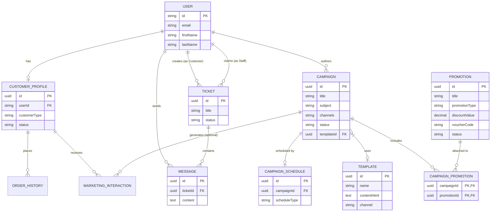

# CRM Data Model & Real-Time Architecture

This document outlines the schema, relationships, and real-time WebSocket architecture for the SentraCX CRM system. The CRM functions as a separate application from the AI-Analytics service, utilizing PostgreSQL as the primary persistence layer and Redis exclusively for real-time WebSocket coordination.

## 1. Entity Definitions (PostgreSQL)

### 1. User (Mirrored from Central Auth)
Represents all system actors, including internal staff (managers, employees) and external customers. Authentication and core identity are managed centrally by the Internal Auth Service.
- `id` (PK): String (Maps to IdentityUser.Id / UUID in Auth Service)
- `email`: String (Unique)
- `firstName`: String (Synced from Auth)
- `lastName`: String (Synced from Auth)
- `displayName`: String (Synced from Auth)
- `employeeNumber`: Integer (Nullable, Synced from Auth for Staff)
- `isDeleted`: Boolean (Soft delete status, Synced from Auth)
- `createdAt`: DateTime
- `updatedAt`: DateTime

*(Design Note: Roles/Permissions are derived from JWT claims upon login, ensuring the Central Auth remains the authoritative source for access control rather than duplicating a local enum.)*

### 2. CustomerProfile
Extended CRM-specific details for external customers. Core identity details (name, email) are kept on the `User` record.
- `id` (PK): UUID
- `userId` (FK): String (One-to-One with User)
- `phoneNumber`: String (Nullable)
- `customerType`: Enum (Regular, InstitutionalBuyer, VIP, Lead)
- `status`: Enum (Active, Inactive, Suspended)
- `notes`: Text (Nullable)
- `profileImage`: String (URL, Nullable)
- `address`: String (Nullable)
- `createdAt`: DateTime
- `updatedAt`: DateTime

### 3. Campaign
Manages marketing and outreach campaigns across channels (Email, InApp, Facebook, Twitter, Instagram).
- `id` (PK): UUID
- `title`: String
- `subject`: String
- `description`: Text
- `channels`: Array<String> (Email, InApp, Facebook, Twitter, Instagram)
- `status`: Enum (Draft, Active, Ended)
- `templateId` (FK): UUID (Nullable, references Template)
- `imageUrl`: String (Nullable)
- `createdBy` (FK): UUID (Staff)
- `createdAt`: DateTime

### 4. CampaignSchedule
Manages the recurrence rules for campaigns.
- `id` (PK): UUID
- `campaignId` (FK): UUID (One-to-One with Campaign)
- `scheduleType`: Enum (SendNow, Scheduled, Recurring)
- `recurrenceDays`: Array<Enum(Monday...Sunday)> (Nullable, used if Recurring)
- `startDate`: DateTime (Nullable)
- `endDate`: DateTime (Nullable)
- `nextRunAt`: DateTime (Nullable)

### 5. Promotion
Manages discount codes, vouchers, free shipping, buy-one-get-one, and cashbacks.
- `id` (PK): UUID
- `title`: String
- `description`: Text
- `promotionType`: Enum (Discount, Voucher, FreeShipping, BuyOneGetOne, Cashback)
- `discountValue`: Decimal (Nullable, required for Discount & Cashback)
- `voucherCode`: String (Nullable, required for Voucher)
- `startDate`: DateTime (Nullable)
- `endDate`: DateTime (Nullable)
- `status`: Enum (Draft, Active, Cancelled, Accomplished)
- `createdAt`: DateTime

### 6. CampaignPromotion
Join table for many-to-many linking between Campaigns and Promotions.
- `campaignId` (FK): UUID (PK)
- `promotionId` (FK): UUID (PK)

### 7. Template
HTML email and message template repository.
- `id` (PK): UUID
- `name`: String
- `description`: String (Nullable)
- `contentHtml`: Text
- `thumbnailUrl`: String (Nullable)
- `channel`: Enum (Email, InApp, Social)
- `createdAt`: DateTime

### 8. MarketingInteraction
Tracks the history of interactions between a customer and the business.
- `id` (PK): UUID
- `customerId` (FK): UUID
- `interactionSource`: Enum (Campaign, ManualOutreach)
- `campaignId` (FK): UUID (Nullable)
- `title`: String
- `description`: Text
- `channel`: Enum (Email, InApp, Call, Meeting)
- `interactionType`: String (e.g., Sent, Opened, Clicked, Logged)
- `sentAt`: DateTime

### 9. Ticket
Customer support inquiries and requests.
- `id` (PK): UUID
- `title`: String
- `description`: Text
- `imageUrl`: String (Nullable)
- `status`: Enum (Unclaimed, Claimed, Ongoing, Completed, Canceled)
- `customerId` (FK): UUID (Created By)
- `assignedToId` (FK): UUID (Claimed By Staff, Nullable)
- `createdAt`: DateTime
- `updatedAt`: DateTime

### 10. Message (Conversation)
Real-time chat messages linked to specific tickets.
- `id` (PK): UUID
- `ticketId` (FK): UUID
- `senderId` (FK): UUID
- `content`: Text
- `isRead`: Boolean (Default: False)
- `sentAt`: DateTime

### 11. OrderHistory (External/Synced)
Read-only view of e-commerce orders linked to a customer.
- `id` (PK): UUID
- `customerId` (FK): UUID
- `orderNumber`: String
- `totalAmount`: Decimal
- `status`: String
- `orderedAt`: DateTime

---

## 2. Redis Integration for WebSocket Chat

The CRM uses Redis strictly for **real-time transport and coordination**, not persistence. PostgreSQL remains the absolute source of truth. Every chat message is committed to PostgreSQL and simultaneously published to Redis to achieve real-time fan-out across server nodes. 

---

## 3. Entity Relationship Diagram

