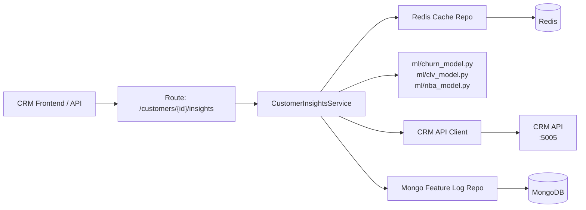

# AI-Analytics: Customer Insights (Churn, CLV, NBA)

## Problem Statement

The AI-Analytics service exists as a skeleton with no working features. The first deliverable is a Customer Insights API that provides churn risk scores, Customer Lifetime Value predictions, and Next-Best-Action recommendations for any given customer — consumed by the CRM frontend.

## Requirements

- `GET /api/v1/customers/{customer_id}/insights` returns churn score, CLV prediction, and NBA recommendation
- Scores are computed via heuristic rules based on customer profile + order history pulled from the CRM API
- Computed scores are cached in Redis with TTL (avoid recalculating on every request)
- Customer feature snapshots are stored in MongoDB for historical tracking
- The service authenticates to the CRM API (service-to-service, JWT or shared key)
- Clean layering: route → service → repository/ML, no shortcuts

## Background

- CRM already exposes `GET /api/v1/customers/{id}` and `GET /api/v1/customers/{id}/orders`
- AI-Analytics has empty folder structure with FastAPI + health check
- Missing dependencies: `redis[hiredis]`, `httpx` (runtime), `pydantic-settings`
- MongoDB is declared (motor) but not connected
- No config/settings module exists yet

## Proposed Solution

Build the Customer Insights feature end-to-end following the layered architecture defined in AGENTS.md. The heuristic models live in `ml/` and can be replaced with trained models later without changing the service or route layers.

## Decisions

- **ML approach:** Heuristic/rule-based scoring. Architecture supports swapping in real ML models later via the `ml/` layer.
- **Data flow:** Pull-based — AI-Analytics calls CRM REST API on demand. Webhook push deferred to later.
- **Stores:** MongoDB + Redis only. pgvector deferred to Ticket Intelligence plan.
- **Embeddings:** Not needed for this feature. Will use local `sentence-transformers` when pgvector is introduced later.

## Task Breakdown

### Task 1: Core configuration and settings module

**Objective:** Create `app/core/config.py` with Pydantic Settings for all env variables (Mongo URI, Redis URL, CRM API base URL, JWT secret, app port, etc.)

**Implementation guidance:**
- Add `pydantic-settings` to dependencies in `pyproject.toml` and `requirements.txt`
- Update `.env.example` with new variables (`REDIS_URL`, `CRM_API_BASE_URL`)
- Wire settings into `main.py` via lifespan or startup

**Test:** Unit test that settings load from env vars with defaults.

**Demo:** App starts and logs configuration (redacted secrets).

---

### Task 2: MongoDB connection setup and lifecycle

**Objective:** Implement `app/db/mongo.py` — async Motor client initialization and shutdown via FastAPI lifespan.

**Implementation guidance:**
- Expose a dependency (`get_mongo_db`) in `app/api/v1/deps.py` that yields the database instance
- Use Motor's async client with connection pooling
- Graceful shutdown on app termination

**Test:** Integration test that connects to Mongo and pings successfully.

**Demo:** App startup connects to MongoDB, `/health` reports mongo status.

---

### Task 3: Redis connection setup and lifecycle

**Objective:** Implement `app/db/redis.py` — async Redis client (using `redis.asyncio`) initialization and shutdown via lifespan.

**Implementation guidance:**
- Add `redis[hiredis]` to dependencies
- Expose a dependency (`get_redis`) in `app/api/v1/deps.py`
- Use connection pooling

**Test:** Integration test that connects to Redis and pings.

**Demo:** App startup connects to Redis, `/health` reports redis status.

---

### Task 4: CRM API client

**Objective:** Create `app/lib/crm_client.py` — async HTTP client (httpx) that calls CRM endpoints.

**Implementation guidance:**
- Add `httpx` to main dependencies in `pyproject.toml` and `requirements.txt`
- Methods: `get_customer(customer_id)`, `get_customer_orders(customer_id)`
- Handle auth headers (forward JWT or use service token from config)
- Handle errors gracefully (CRM down → clear error, not crash)
- Base URL from config settings

**Test:** Unit test with mocked httpx responses.

**Demo:** CRM client can be called and returns typed data.

---

### Task 5: Heuristic ML models (churn, CLV, NBA)

**Objective:** Implement scoring logic in `app/ml/` — one file per model.

**Implementation guidance:**
- `ml/churn_model.py`: score (0.0–1.0) based on days since last order, order frequency decline, ticket count, account age
- `ml/clv_model.py`: predict lifetime value based on historical order total, frequency, average order value, customer tenure
- `ml/nba_model.py`: rule-based recommendation (e.g., high churn + high CLV → "offer_discount", low engagement → "send_reactivation_campaign")
- Each model exposes a single `predict(features: dict) -> float | dict` function
- Pure functions, no I/O, no dependencies on FastAPI or databases

**Test:** Unit tests for each model with known input/output pairs covering edge cases.

**Demo:** Models produce deterministic, reasonable scores for sample inputs.

---

### Task 6: Pydantic schemas for Customer Insights

**Objective:** Create `app/schemas/customer_schemas.py` with request/response models.

**Implementation guidance:**
- `CustomerInsightsResponse`: churn_score (float), clv_prediction (float), next_best_action (str), confidence (float), computed_at (datetime)
- Internal: `CustomerFeatures` schema for the intermediate feature vector passed to ML models
- Follow Pydantic v2 patterns

**Test:** Schema validation tests (valid/invalid inputs).

**Demo:** Schemas serialize/deserialize correctly.

---

### Task 7: Redis cache repository

**Objective:** Create `app/repositories/redis/customer_cache_repository.py`.

**Implementation guidance:**
- `get_insights(customer_id)` → cached insights or None
- `set_insights(customer_id, insights, ttl=86400)` → store with 24h TTL
- Key pattern: `customer:{id}:churn_score`, `customer:{id}:clv`, `customer:{id}:next_action` (or a single JSON key `customer:{id}:insights`)
- Serialize/deserialize with JSON

**Test:** Unit test with mock Redis.

**Demo:** Cache set/get works with TTL.

---

### Task 8: MongoDB feature log repository

**Objective:** Create `app/repositories/mongo/customer_feature_repository.py`.

**Implementation guidance:**
- `save_feature_log(customer_id, features)` → insert into `CustomerFeatureLogs` collection
- `get_latest_features(customer_id)` → most recent feature snapshot (sorted by `recorded_at` desc)
- Follow the document shape from `docs/architecture/ai-analytics-data-model.md`

**Test:** Integration test with Mongo (or mock).

**Demo:** Feature logs persist and are retrievable.

---

### Task 9: Customer Insights service (orchestration)

**Objective:** Create `app/services/customer_insights_service.py` — the orchestration layer.

**Implementation guidance:**
- Check Redis cache first → return if fresh
- If cache miss: call CRM client → build feature vector → run ML models → cache result → log to Mongo → return
- Handles CRM unavailability gracefully (return stale cache or error)
- No FastAPI-specific objects (no Request/Response) — pure Python in, Pydantic schema out

**Test:** Unit test with mocked dependencies (CRM client, cache repo, Mongo repo, ML models).

**Demo:** Full flow works end-to-end with mocks.

---

### Task 10: Customer Insights route and wiring

**Objective:** Create `app/api/v1/routes/customers.py` with `GET /api/v1/customers/{customer_id}/insights`.

**Implementation guidance:**
- Wire the route into the FastAPI app via router inclusion in `main.py`
- Inject dependencies (service, DB connections) via FastAPI DI
- Return proper HTTP status codes (200, 404 if customer not found in CRM, 503 if CRM down)
- Response model: `CustomerInsightsResponse`

**Test:** Integration test using FastAPI TestClient — full request/response cycle with mocked CRM.

**Demo:** Hit the endpoint, get back real insights JSON. Repeat — see cache hit (faster, same result). Check MongoDB — feature log was stored.
