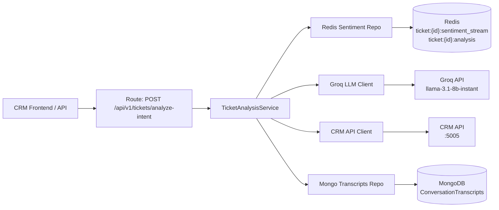

# AI-Analytics Ticket Intelligence (Sentiment, Categorization, Urgency)

## Problem Statement

The AI-Analytics service needs to analyze ticket text to provide sentiment scoring, automatic categorization, and urgency/priority scoring. This uses Groq API (free tier, `llama-3.1-8b-instant`) for LLM-powered text classification, with heuristic fallback when Groq is unavailable.

## Requirements

- `POST /api/v1/tickets/analyze-intent` (matching `docs/architecture/ai-analytics-data-model.md` Section 5)
- Returns: sentiment (positive/neutral/negative + score), predicted category, urgency score, reasoning
- Uses Groq API free tier (`llama-3.1-8b-instant`) for text classification
- Results cached in Redis (1h TTL for full analysis, Sorted Set for sentiment history)
- Analysis transcripts stored in MongoDB `ConversationTranscripts` collection (per data model)
- Graceful fallback to heuristic analysis if Groq is unavailable
- Rate limiting awareness: 30 RPM / 6K TPM on Groq free tier

## Background

- Groq free tier: `llama-3.1-8b-instant` — 30 RPM, 14.4K RPD, 6K TPM, 500K TPD, 560 t/s
- Groq uses OpenAI-compatible API (`https://api.groq.com/openai/v1/chat/completions`)
- AI-Analytics already has: MongoDB/Redis connections, CRM client, config module, test framework
- Data model docs already define:
  - `ConversationTranscripts` MongoDB collection (Section 2)
  - `ticket:{id}:sentiment_stream` Redis Sorted Set (Section 3)
  - `POST /api/v1/tickets/analyze-intent` API contract (Section 5)
- Depends on PR 1 (CRM Ticket endpoints) being merged first

## Proposed Solution

Build Groq-powered ticket text analysis following the layered architecture. Single LLM call classifies sentiment, category, and urgency simultaneously. Redis caches results and tracks sentiment over time. MongoDB stores conversation transcripts for historical analysis.



## Decisions

- **Model**: `llama-3.1-8b-instant` — best free tier limits (14.4K RPD vs 1K for 70B), 560 t/s, sufficient for classification
- **Endpoint path**: `POST /api/v1/tickets/analyze-intent` (matches data model docs Section 5)
- **MongoDB collection**: `ConversationTranscripts` (matches data model docs Section 2)
- **Redis patterns**:
  - `ticket:{crms_ticket_id}:sentiment_stream` (Sorted Set, matches data model Section 3)
  - `ticket:{crms_ticket_id}:analysis` (String with 1h TTL for full analysis cache)
- **Fallback**: Keyword-based heuristic analysis when Groq is unavailable (429, timeout, etc.)
- **Categories**: billing, shipping, technical_issue, complaint, refund_request, general_inquiry, product_quality, account_issue

## Branch

`feature/ai-analytics-ticket-intelligence`

## Dependencies

- PR 1 (`feature/crm-ticket-management`) must be merged first — provides `GET /api/v1/tickets/{id}` and `GET /api/v1/tickets/{ticketId}/messages` endpoints

## Task Breakdown

### Task 1: Groq LLM client module

**Objective:** Create `app/lib/groq_client.py` — async wrapper for Groq's OpenAI-compatible API.

**Implementation guidance:**
- Add `groq` (official Python SDK) to `pyproject.toml` dependencies
- Class `GroqClient` with method: `analyze(system_prompt: str, user_prompt: str) -> dict`
- Uses `llama-3.1-8b-instant` model
- Requests JSON response mode for structured output
- Handle rate limiting (429) with exponential backoff (max 3 retries)
- Handle timeouts (10s) and API errors gracefully
- Config: `GROQ_API_KEY` and `GROQ_MODEL_ID` from settings
- Returns parsed dict from JSON response

**Test:** Unit tests with mocked responses (success, rate limit 429, timeout, malformed JSON).

**Demo:** Client sends prompt, receives structured JSON response.

---

### Task 2: Extend CRM client with ticket endpoints

**Objective:** Add ticket/message fetching methods to `app/lib/crm_client.py`.

**Implementation guidance:**
- Add `get_ticket(ticket_id: str) -> dict | None`
- Add `get_ticket_messages(ticket_id: str) -> list[dict]`
- Follow existing error handling pattern (return None/[] on failure)
- URLs: `GET /api/v1/tickets/{ticket_id}` and `GET /api/v1/tickets/{ticket_id}/messages`

**Test:** Unit tests with mocked httpx responses.

**Demo:** CRM client fetches ticket and message data.

---

### Task 3: Ticket analyzer ML module (Groq-powered + fallback)

**Objective:** Create `app/ml/ticket_analyzer.py` — LLM-powered analysis with heuristic fallback.

**Implementation guidance:**
- Class `TicketAnalyzer` initialized with `GroqClient`
- Method `analyze(title: str, description: str, messages: list[str]) -> dict`
- Single Groq call with structured prompt returning JSON:
  ```json
  { "sentiment": "negative", "sentiment_score": -0.75, "category": "shipping", "urgency_score": 0.85, "reasoning": "Customer is frustrated about delayed delivery" }
  ```
- Categories: billing, shipping, technical_issue, complaint, refund_request, general_inquiry, product_quality, account_issue
- Sentiment: positive/neutral/negative with float score (-1.0 to 1.0)
- Urgency: 0.0 to 1.0
- Fallback method `_heuristic_analyze(title, description, messages) -> dict`:
  - Keyword-based classification
  - Simple sentiment heuristics (negative keywords → negative)
  - Used when Groq is unavailable

**Test:** Unit tests with mocked Groq client covering LLM path and fallback path.

**Demo:** Analyzer returns structured analysis; gracefully falls back when Groq unavailable.

---

### Task 4: Ticket analysis Pydantic schemas

**Objective:** Create `app/schemas/ticket_schemas.py`.

**Implementation guidance:**
- `TicketAnalysisRequest`: ticket_id (str, optional), text (str, optional), include_messages (bool, default True)
- `TicketAnalysisResponse`: ticket_id (str), sentiment (str), sentiment_score (float), predicted_category (str), urgency_score (float), reasoning (str), computed_at (datetime), cached (bool)
- Match documented API response from Section 5: `{ "predicted_category": "technical_issue", "urgency_score": 0.9 }`
- Validators: sentiment in [positive, neutral, negative], category in allowed list, scores in valid ranges

**Test:** Schema validation tests (valid/invalid inputs).

**Demo:** Schemas validate and serialize correctly.

---

### Task 5: Redis ticket sentiment repository

**Objective:** Create `app/repositories/redis/ticket_sentiment_repository.py`.

**Implementation guidance:**
- Follow documented Redis patterns from AI-Analytics data model Section 3:
  - **Sorted Set**: `ticket:{crms_ticket_id}:sentiment_stream` — score = Unix timestamp, value = sentiment_score
  - **String with TTL**: `ticket:{crms_ticket_id}:analysis` — full JSON analysis, 1h TTL
- Methods:
  - `add_sentiment_score(ticket_id, sentiment_score, timestamp)` → ZADD
  - `get_sentiment_history(ticket_id) -> list[tuple[float, float]]` → ZRANGEBYSCORE
  - `get_cached_analysis(ticket_id) -> dict | None` → GET + JSON parse
  - `set_cached_analysis(ticket_id, analysis, ttl=3600)` → SET with TTL
  - `invalidate_analysis(ticket_id)` → DEL

**Test:** Unit tests with mock Redis.

**Demo:** Sentiment scores accumulate in sorted set; analysis caches with TTL.

---

### Task 6: MongoDB conversation transcripts repository

**Objective:** Create `app/repositories/mongo/conversation_transcript_repository.py`.

**Implementation guidance:**
- Collection: `ConversationTranscripts` (matching documented schema in Section 2)
- Document shape:
  ```json
  {
    "crms_ticket_id": "uuid",
    "full_transcript_text": "Customer: ... Agent: ...",
    "extracted_entities": [{"entity_type": "...", "value": "..."}],
    "auto_summary": "",
    "sentiment": "negative",
    "sentiment_score": -0.75,
    "predicted_category": "technical_issue",
    "urgency_score": 0.85,
    "analyzed_at": "2026-07-17T00:00:00Z"
  }
  ```
- Methods:
  - `save_analysis(ticket_id, analysis_data)` → insert
  - `get_latest_analysis(ticket_id) -> dict | None` → find one, sorted by analyzed_at desc
  - `get_analysis_history(ticket_id) -> list[dict]` → all analyses for ticket

**Test:** Unit tests with mock MongoDB.

**Demo:** Analysis transcripts persist and are retrievable.

---

### Task 7: Ticket analysis service (orchestration)

**Objective:** Create `app/services/ticket_analysis_service.py`.

**Implementation guidance:**
- Class `TicketAnalysisService` with dependencies: CrmClient, TicketAnalyzer, TicketSentimentRepository, ConversationTranscriptRepository
- Method `analyze_ticket(request: TicketAnalysisRequest) -> TicketAnalysisResponse`
- Flow:
  1. Check Redis cache (`ticket:{id}:analysis`) → return if fresh
  2. Fetch ticket from CRM → 404 if not found
  3. Fetch messages from CRM (if include_messages=True)
  4. Build transcript text from title + description + messages
  5. Run analysis (LLM → fallback if unavailable)
  6. Cache full result in Redis (1h TTL)
  7. Add sentiment score to Redis Sorted Set (for trend tracking)
  8. Save to MongoDB `ConversationTranscripts`
  9. Return response
- Error handling: ticket not found (raise error), CRM unavailable (raise error), Groq down (use fallback silently)

**Test:** Unit tests with mocked dependencies (happy path, cache hit, CRM down, Groq rate limited → fallback).

**Demo:** Full pipeline works end-to-end with mocks.

---

### Task 8: Ticket analysis route, DI wiring, and config

**Objective:** Create route at `POST /api/v1/tickets/analyze-intent` and wire dependencies.

**Implementation guidance:**
- Add route in `app/api/v1/routes/tickets.py`
- Endpoint: `POST /api/v1/tickets/analyze-intent`
  - Request body: `TicketAnalysisRequest`
  - Response: `TicketAnalysisResponse`
  - Status codes: 200 (success), 404 (ticket not found), 503 (CRM unavailable)
- Register router in `main.py`
- Wire DI in `app/api/v1/deps.py`: GroqClient, TicketAnalyzer, TicketSentimentRepository, ConversationTranscriptRepository, TicketAnalysisService
- Add to `app/core/config.py`: `groq_api_key: str = ""`, `groq_model_id: str = "llama-3.1-8b-instant"`
- Update `.env.example` with `GROQ_API_KEY` and `GROQ_MODEL_ID`

**Test:** Integration test with FastAPI TestClient — full request/response with mocked CRM and Groq.

**Demo:** `POST /api/v1/tickets/analyze-intent` with ticket_id → structured analysis JSON. Second call → cache hit. Redis sorted set has sentiment score. MongoDB has transcript.

---

### Task 9: Documentation updates

**Objective:** Update all relevant docs to reflect both implementations.

**Implementation guidance:**
- Update `docs/architecture/ai-analytics-data-model.md`:
  - Add note about Groq integration in Section 2 under ConversationTranscripts
  - Add `ticket:{id}:analysis` String key pattern to Section 3 (Redis)
- Update `docs/api/api-ai-analytics.md`:
  - Add `POST /api/v1/tickets/analyze-intent` endpoint documentation
- Update `docs/api/api-crm.md`:
  - Add Ticket and Message endpoint documentation
- Update `docs/development/ai-analytics-specs.md`:
  - Mark done: Sentiment Analysis [x], Auto-Categorization [x], Urgency/Priority Scoring [x]
- Update `docs/development/crm-specs.md`:
  - Mark CRM-005 and CRM-006 acceptance criteria as done
- Update `docs/development/dev-phases.md`:
  - Mark relevant Phase 2 ticketing tasks as done

**Test:** N/A.

**Demo:** All documentation reflects the current implementation state accurately.
