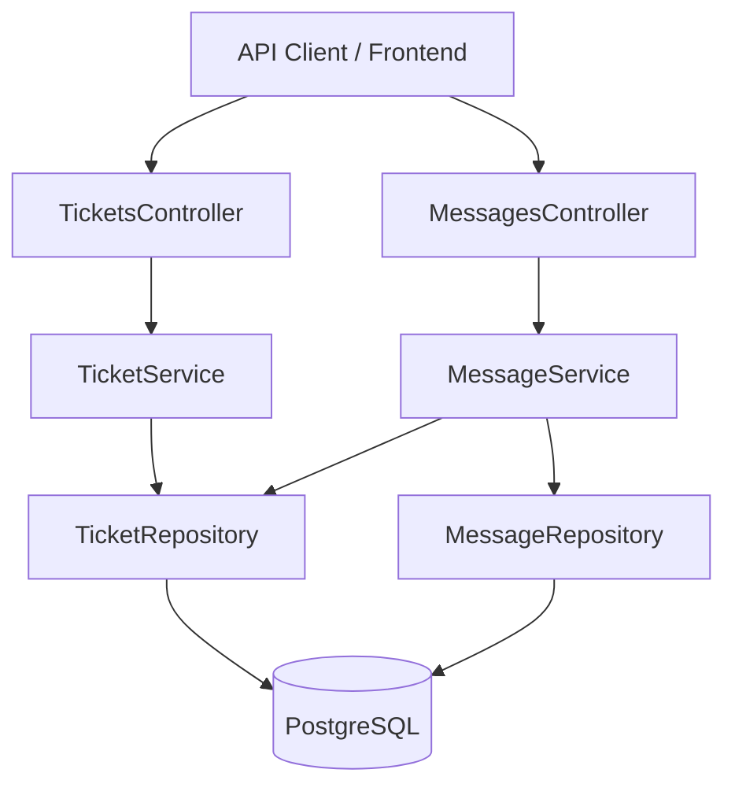
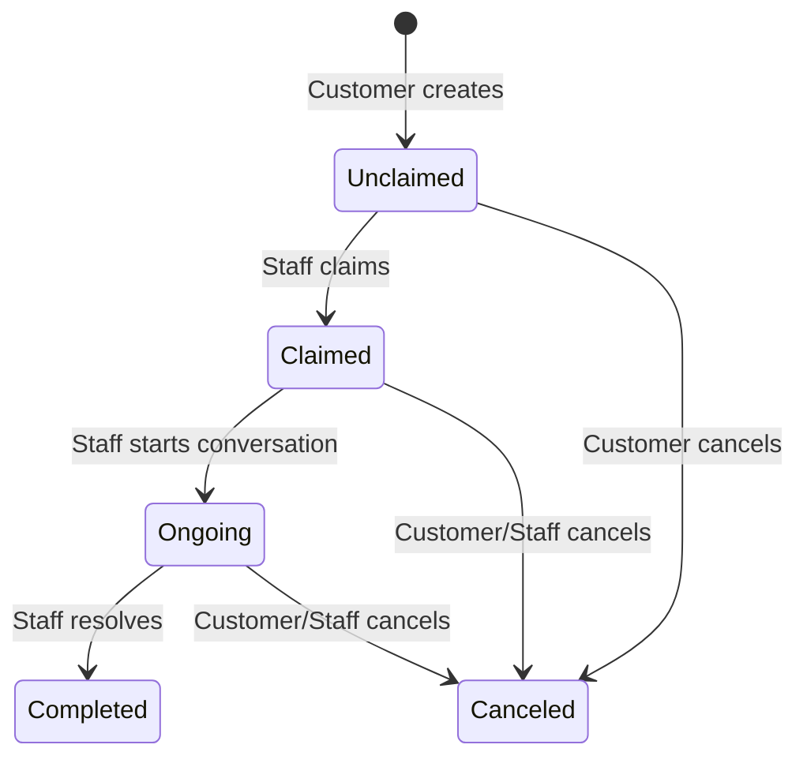

# CRM Ticket & Message Management (Full CRUD + State Machine)

## Problem Statement

The CRM currently has no Ticket or Message model/endpoints. Phase 1 (Customer Management, Orders, JIT Provisioning) is complete, but Phase 2 (Ticketing) has not been started. The AI-Analytics Ticket Intelligence feature depends on these CRM endpoints existing so it can consume ticket data via REST API.

## Requirements

- Full Ticket CRUD matching CRM-005 (Staff) and CRM-006 (Customer) acceptance criteria
- Ticket state machine: Unclaimed → Claimed → Ongoing → Completed/Canceled
- Message model and endpoints for ticket conversations
- Entity models matching `docs/architecture/crm-data-model.md` exactly
- Follow existing layered architecture: Controller → Service → Repository
- Auth temporarily disabled for manual testing during development

## Background

- Phase 1 done: User, CustomerProfile, OrderHistory entities + full CRUD
- CRM data model defines Ticket and Message schemas in `docs/architecture/crm-data-model.md`
- CRM-005/CRM-006 specs define acceptance criteria in `docs/development/crm-specs.md`
- Existing patterns: primary constructor DI, FluentValidation, static mappers, EF Fluent API configs
- Table naming: snake_case (`customer_profiles`, `order_histories`)
- Status stored as string (not EF enum), matching existing pattern

## Proposed Solution

Build full Ticket + Message CRUD following existing patterns established in Phase 1. Enforce ticket state machine in the service layer.



### State Machine



## Decisions

- **Auth disabled temporarily** — `[Authorize]` commented out across all controllers + middleware disabled in `Program.cs` for manual testing. TODO comment added to re-enable before production.
- **No WebSocket yet** — Messages are REST-only in this PR. Real-time chat (Phase 3) adds WebSocket + Redis Pub/Sub later.
- **No receiverId on Message** — Per data model design note, recipient derived dynamically from Ticket's customerId/assignedToId.

## Branch

`feature/crm-ticket-management`

## Task Breakdown

### Task 0: Temporarily disable auth for manual testing

**Objective:** Comment out authentication across all controllers and middleware so endpoints can be tested without JWT.

**Implementation guidance:**
- Comment out `[Authorize]` on `CustomersController`, `OrdersController`, `WebhooksController`
- Comment out `app.UseAuthentication()` and `app.UseMiddleware<JitProvisioningMiddleware>()` in `Program.cs`
- Add `// TODO: Re-enable authentication before production/merge to main` comments
- New controllers will be built without `[Authorize]` initially

**Test:** All existing endpoints remain accessible without Bearer token.

**Demo:** `GET /api/v1/customers` returns data without auth header.

---

### Task 1: Ticket and Message entity models

**Objective:** Create `Ticket` and `Message` EF Core entities matching `docs/architecture/crm-data-model.md`.

**Implementation guidance:**
- `Models/Ticket.cs`:
  - Id (Guid PK), Title (string), Description (text), ImageUrl (string, nullable)
  - Status (string: Unclaimed/Claimed/Ongoing/Completed/Canceled)
  - CustomerId (Guid FK → CustomerProfile), AssignedToId (string FK → User, nullable)
  - CreatedAt, UpdatedAt
  - Navigation: Customer (CustomerProfile), AssignedTo (User), Messages (ICollection<Message>)
- `Models/Message.cs`:
  - Id (Guid PK), TicketId (Guid FK → Ticket), SenderId (string FK → User)
  - Content (text), IsRead (bool, default false), SentAt (DateTime)
  - Navigation: Ticket, Sender (User)
- Add `ICollection<Ticket> Tickets` to `CustomerProfile` navigation properties
- Register `DbSet<Ticket>` and `DbSet<Message>` in `AppDbContext.cs`
- Create `Data/Configurations/TicketConfiguration.cs`:
  - Table: `tickets`, UUID default, indexes on CustomerId/Status/AssignedToId
  - Title: required, max 200. Description: text. Status: required, max 20, default "Unclaimed"
  - FK to CustomerProfile (cascade delete), FK to User (set null on delete)
- Create `Data/Configurations/MessageConfiguration.cs`:
  - Table: `messages`, UUID default, index on TicketId
  - Content: required, text. IsRead: default false. SentAt: required.
  - FK to Ticket (cascade delete), FK to User via SenderId (restrict)

**Test:** Migration generates expected schema with FKs and indexes.

**Demo:** `dotnet ef migrations add AddTicketsAndMessages` succeeds.

---

### Task 2: Ticket repository (data access)

**Objective:** Create `ITicketRepository` and `TicketRepository`.

**Implementation guidance:**
- `Interfaces/Repositories/ITicketRepository.cs`
- `Repositories/TicketRepository.cs`
- Methods:
  - `GetAllAsync(int page, int pageSize, string? status, Guid? customerId)` → paginated, filtered
  - `GetByIdAsync(Guid id)` → include Customer→User, AssignedTo navs
  - `AddAsync(Ticket ticket)`
  - `UpdateAsync(Ticket ticket)`
- Follow `CustomerProfileRepository` pattern: primary constructor DI, Include navigation properties
- Filter by status and customerId when provided (both optional)
- Order by CreatedAt descending

**Test:** Unit tests with in-memory SQLite verifying CRUD and filtering.

**Demo:** Repository persists and retrieves tickets with navigation properties.

---

### Task 3: Message repository (data access)

**Objective:** Create `IMessageRepository` and `MessageRepository`.

**Implementation guidance:**
- `Interfaces/Repositories/IMessageRepository.cs`
- `Repositories/MessageRepository.cs`
- Methods:
  - `GetByTicketIdAsync(Guid ticketId)` → ordered by SentAt asc, include Sender
  - `AddAsync(Message message)`
  - `MarkAsReadAsync(Guid messageId)` → set IsRead = true

**Test:** Unit tests verifying ordered retrieval and read status updates.

**Demo:** Messages stored and retrieved in chronological order per ticket.

---

### Task 4: Ticket DTOs

**Objective:** Create request/response DTOs for Ticket and Message API.

**Implementation guidance:**
- `DTOs/Requests/CreateTicketRequestDto.cs`: Title (string), Description (string), ImageUrl (string?, optional)
- `DTOs/Requests/UpdateTicketStatusRequestDto.cs`: Status (string)
- `DTOs/Requests/CreateMessageRequestDto.cs`: Content (string)
- `DTOs/Responses/TicketResponseDto.cs`: Id, Title, Description, ImageUrl, Status, CustomerId, CustomerName, AssignedToId, AssignedToName, CreatedAt, UpdatedAt
- `DTOs/Responses/TicketListResponseDto.cs`: Id, Title, Status, CustomerName, CreatedAt
- `DTOs/Responses/MessageResponseDto.cs`: Id, SenderId, SenderName, Content, IsRead, SentAt
- One DTO per file

**Test:** Covered by integration tests.

**Demo:** DTOs compile and match API contract.

---

### Task 5: Ticket and Message mappers

**Objective:** Create `Mappers/TicketMapper.cs` and `Mappers/MessageMapper.cs`.

**Implementation guidance:**
- `TicketMapper`: static methods `ToDetailResponse(Ticket)`, `ToListResponse(Ticket)`
- `MessageMapper`: static method `ToResponse(Message)`
- Map navigation property data (Customer.User.DisplayName, AssignedTo.DisplayName, Sender.DisplayName)
- Follow existing `CustomerMapper` pattern

**Test:** Unit tests verifying correct field mapping.

**Demo:** Entities map to DTOs correctly.

---

### Task 6: Ticket validators

**Objective:** Create FluentValidation validators for ticket request DTOs.

**Implementation guidance:**
- `Validators/CreateTicketRequestValidator.cs`: Title required (max 200), Description required (max 5000), ImageUrl optional (max 500)
- `Validators/UpdateTicketStatusRequestValidator.cs`: Status must be one of: Unclaimed, Claimed, Ongoing, Completed, Canceled
- `Validators/CreateMessageRequestValidator.cs`: Content required (max 5000)

**Test:** Unit tests for valid/invalid inputs.

**Demo:** Invalid requests rejected with clear error messages.

---

### Task 7: Ticket service (business logic + state machine)

**Objective:** Create `ITicketService` and `TicketService` with state machine enforcement.

**Implementation guidance:**
- `Interfaces/Services/ITicketService.cs`
- `Services/TicketService.cs`
- Methods:
  - `GetAllAsync(page, pageSize, status?, customerId?)` → paginated list
  - `GetByIdAsync(id)` → full detail or null
  - `CreateAsync(dto, customerId)` → creates with status=Unclaimed
  - `ClaimAsync(id, staffUserId)` → Unclaimed→Claimed, sets AssignedToId
  - `UpdateStatusAsync(id, dto)` → enforces valid transitions
  - `CancelAsync(id)` → any active→Canceled
- Valid transitions:
  - Unclaimed → Claimed (only via ClaimAsync)
  - Claimed → Ongoing
  - Ongoing → Completed
  - Unclaimed/Claimed/Ongoing → Canceled
- Invalid transitions return false

**Test:** Unit tests covering all valid/invalid state transitions.

**Demo:** Full ticket lifecycle with state machine enforcement.

---

### Task 8: Message service (business logic)

**Objective:** Create `IMessageService` and `MessageService`.

**Implementation guidance:**
- `Interfaces/Services/IMessageService.cs`
- `Services/MessageService.cs`
- Methods:
  - `GetByTicketIdAsync(ticketId)` → list of messages
  - `CreateAsync(ticketId, senderId, dto)` → validate ticket exists and is active (Claimed/Ongoing)
  - `MarkAsReadAsync(messageId)` → mark message read
- Reject message creation if ticket status is Unclaimed, Completed, or Canceled

**Test:** Unit tests for creation rules and rejection for inactive tickets.

**Demo:** Messages accepted on active tickets, rejected on others.

---

### Task 9: Tickets controller

**Objective:** Create `Controllers/TicketsController.cs`.

**Implementation guidance:**
- Route: `api/v1/tickets`
- No `[Authorize]` attribute (auth disabled for testing)
- Endpoints:
  - `GET /api/v1/tickets?page=1&pageSize=20&status=Unclaimed&customerId=...`
  - `GET /api/v1/tickets/{id}`
  - `POST /api/v1/tickets` — body: CreateTicketRequestDto + `customerId` from query param (since no JWT)
  - `PUT /api/v1/tickets/{id}/claim` — body or query for staffUserId
  - `PUT /api/v1/tickets/{id}/status` — body: UpdateTicketStatusRequestDto
  - `DELETE /api/v1/tickets/{id}` — cancel
- Since auth is disabled, accept `customerId`/`staffUserId` as parameters instead of extracting from JWT
- Add `// TODO: Extract userId from JWT claims when auth is re-enabled` comments
- Follow existing controller pattern: primary constructor DI

**Test:** Integration tests verifying all endpoints return correct status codes.

**Demo:** All ticket endpoints accessible via Scalar docs.

---

### Task 10: Messages controller

**Objective:** Create `Controllers/MessagesController.cs`.

**Implementation guidance:**
- Route: `api/v1/tickets/{ticketId:guid}/messages`
- No `[Authorize]` attribute
- Endpoints:
  - `GET /api/v1/tickets/{ticketId}/messages`
  - `POST /api/v1/tickets/{ticketId}/messages` — body: CreateMessageRequestDto + senderId parameter
  - `PUT /api/v1/tickets/{ticketId}/messages/{messageId}/read`
- Accept `senderId` as parameter (TODO: extract from JWT when auth re-enabled)

**Test:** Integration tests for message flow on active tickets.

**Demo:** Full conversation flow testable via Scalar.

---

### Task 11: DI registration, migration, and wiring

**Objective:** Register all new services in `Program.cs`, generate migration, verify end-to-end.

**Implementation guidance:**
- Add to `Program.cs`:
  ```csharp
  builder.Services.AddScoped<ITicketRepository, TicketRepository>();
  builder.Services.AddScoped<IMessageRepository, MessageRepository>();
  builder.Services.AddScoped<ITicketService, TicketService>();
  builder.Services.AddScoped<IMessageService, MessageService>();
  ```
- Generate: `dotnet ef migrations add AddTicketsAndMessages`
- Run full test suite: `dotnet test`
- Verify via manual testing through Scalar docs

**Test:** App starts, migration applies, all endpoints work.

**Demo:** Complete ticket lifecycle: create → claim → send messages → mark read → update status → complete. All via Scalar API docs at `/docs`.
